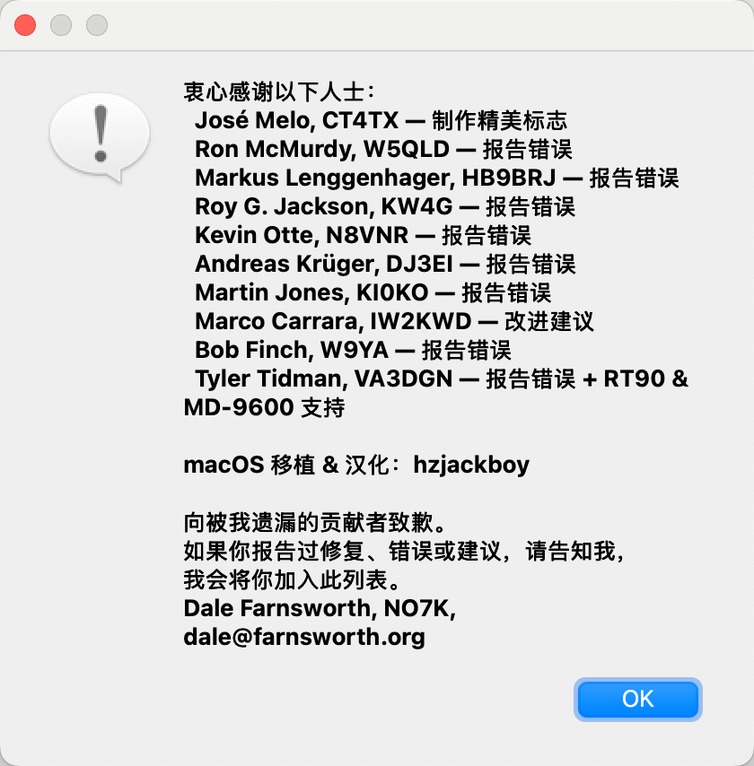
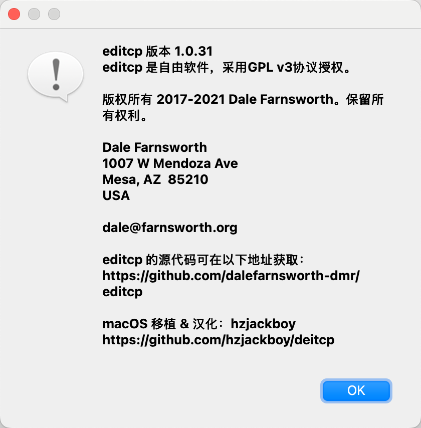

# 🎛️ editcp — DMR 对讲机写频编辑器 / DMR Radio Codeplug Editor

[](https://www.gnu.org/licenses/gpl-3.0)
[](https://github.com/hzjackboy/deitcp)

> **editcp** — 一款开源的 DMR 对讲机写频（Codeplug）编辑工具，支持 Tytera MD380/MD390、Alinco DJ-MD40 等机型。  
> **editcp** — An open-source codeplug editor for DMR radios: Tytera MD380/MD390, Alinco DJ-MD40, and more.

---

## 📑 目录 / Table of Contents

- [🇨🇳 中文说明](#-中文说明)
  - [项目简介](#项目简介)
  - [主要功能](#主要功能)
  - [macOS 移植特性](#macos-移植特性)
  - [与上游的区别](#与上游的区别)
  - [构建方法](#构建方法)
  - [使用方法](#使用方法)
  - [常见问题](#常见问题)
- [🇬🇧 English](#-english)
  - [Introduction](#introduction)
  - [Features](#features)
  - [macOS Port Features](#macos-port-features)
  - [Differences from Upstream](#differences-from-upstream)
  - [Build](#build)
  - [Usage](#usage)
  - [Troubleshooting](#troubleshooting)
- [📜 License](#-license)
- [👤 Credits](#-credits)

---

## 🇨🇳 中文说明

### 项目简介

**editcp** 是一个开源的对讲机写频编辑工具，功能类似于 TYT 官方 CPS 软件。它可以编辑 DMR 对讲机的写频数据（Codeplug），包括信道、联系人、区域等参数。

本项目基于 [DaleFarnsworth-DMR/editcp](https://github.com/DaleFarnsworth-DMR/editcp) 进行了 **完整的 macOS (Apple Silicon / Intel) 移植**，并添加了界面汉化和中英文语言切换功能。

**支持的机型：**

| 品牌 | 型号 |
|------|------|
| Tytera | MD-380, MD-380G, MD-390, MD-390G |
| Tytera | MD-2017, MD-UV380, MD-UV390 |
| Alinco | DJ-MD40 |
| Retevis | RT3, RT8, RT90 |
| 兼容 | 其他使用相同写频格式的对讲机 |

### 主要功能

- **编辑写频数据** — 常规设置、信道、联系人、区域、接收组列表、扫描列表、按键定义、菜单项、隐私设置、GPS 系统、短信
- **拖拽操作** — 列表项拖拽排序，跨文件拖拽复制
- **无限撤销/重做** — 编辑历史完整记录
- **输入验证** — 自动检查字段值的有效性
- **导入/导出** — 支持文本文件、Excel 表格 (.xlsx)、JSON 格式
- **读写对讲机** — 通过 USB/DFU 协议直接读取和写入对讲机写频
- **固件更新** — 写入出厂固件和 md380tools 第三方固件
- **用户数据库** — 下载并写入 DMR 用户数据库

### macOS 移植特性

基于上游项目的 macOS 适配增强：

| 特性 | 说明 |
|------|------|
| **Apple Silicon 原生** | 支持 M1/M2/M3/M4 系列芯片，arm64 原生编译 |
| **Intel 兼容** | 同时支持 x86_64 架构 |
| **界面汉化** | 完整的中文界面，所有菜单、对话框、字段标签均已汉化 |
| **中英文切换** | 帮助 → 语言 菜单一键切换，实时生效 |
| **USB 读写** | 修复 macOS 上 libusb 重复初始化崩溃问题 |
| **代码签名** | 内置 ad-hoc 签名脚本，解决 macOS 15 Gatekeeper 问题 |
| **USB 权限** | 自动配置 `com.apple.security.device.usb` 授权 |
| **自动构建** | 一键构建脚本，自动处理 Qt 框架部署和签名 |

### 📸 界面截图 / Screenshots

<p align="center">
  
  
</p>
<p align="center">
  
</p>
<p align="center">
  
</p>

---

### 与上游的区别

| 对比项 | 上游 (DaleFarnsworth-DMR) | 本 Fork |
|--------|---------------------------|---------|
| macOS 支持 | 仅基础构建说明 | 完整移植，含 Apple Silicon |
| 界面语言 | 仅英文 | 中文 + 英文，运行时切换 |
| USB 读写 | Linux/Windows 优先 | 修复 macOS libusb 兼容问题 |
| 代码签名 | 不适用 | 完整的 macOS 签名流程 |
| 构建脚本 | Makefile (Linux) | build_macos.sh 一键构建 |

### 构建方法

#### 前置要求

```bash
# 使用 Homebrew 安装依赖
brew install go qt@5 pkg-config libusb
```

> ⚠️ 需要 Xcode Command Line Tools：`xcode-select --install`

#### 一键构建

```bash
git clone https://github.com/hzjackboy/deitcp.git
cd deitcp
./build_macos.sh
```

构建完成后，App 位于 `deploy/darwin/deitcp.app`。

#### 手动构建

```bash
# 设置环境变量
export QT_DIR="/opt/homebrew/opt/qt@5"
export PKG_CONFIG_PATH="$QT_DIR/lib/pkgconfig:$PKG_CONFIG_PATH"
export CGO_CPPFLAGS="-DQT_CORE_LIB -DQT_GUI_LIB -DQT_WIDGETS_LIB -I$QT_DIR/include -I$QT_DIR/include/QtCore -I$QT_DIR/include/QtGui -I$QT_DIR/include/QtWidgets -F$QT_DIR/lib"
export CGO_LDFLAGS="-F$QT_DIR/lib -framework QtCore -framework QtGui -framework QtWidgets -framework QtPrintSupport"

# 构建
qtdeploy build desktop

# 签名
./build_macos.sh  # 或手动签名
```

### 使用方法

#### 读取对讲机写频

1. **对讲机进入刷机模式**：关机 → 按住 **PTT + PTT 上方按键** → 拧音量旋钮开机
   - LED 指示灯会红绿交替闪烁
2. 连接写频线到电脑 USB 口
3. 打开 editcp → 点击菜单 **对讲机 → 从对讲机读取写频**
4. 选择对讲机型号和频率范围
5. 等待读取完成

#### 编辑写频数据

通过 **编辑** 菜单可以访问所有可编辑的项目：

| 菜单项 | 功能 |
|--------|------|
| 基本信息 | 查看对讲机型号、频率范围等只读信息 |
| 常规设置 | 对讲机名称、ID、背光、麦克风电平等 |
| 菜单项 | 自定义菜单功能按键分配 |
| 按键定义 | 物理按键功能、一键通、数字键快速联系人 |
| 短信 | 预设短信内容 |
| 隐私设置 | 按键功能配置 |
| 信道 | 频率、色码、时隙、功率等 |
| 联系人 | DMR 联系人列表 |
| 接收组列表 | 接收组配置 |
| 扫描列表 | 扫描信道配置 |
| 区域 | 信道分组 |

#### 写入写频到对讲机

1. 对讲机进入刷机模式（同上）
2. 点击 **对讲机 → 写入写频到对讲机**
3. 确认警告信息后点击 Yes

#### 切换界面语言

**帮助 → 语言 → 中文 / English**

切换后关闭并重新打开下级窗口以刷新内容。

### 常见问题

<details>
<summary><b>❌ App 闪退无法打开</b></summary>

代码签名问题，终端执行：
```bash
codesign --force --deep --sign - deploy/darwin/deitcp.app
```
</details>

<details>
<summary><b>❌ USB 连接错误 / libusb init failed</b></summary>

1. 检查系统设置 → 隐私与安全性 → **USB 配件** → 是否已允许
2. 检查对讲机是否处于刷机模式（LED 红绿闪烁）
3. 重新插拔写频线
</details>

<details>
<summary><b>❌ 写入写频时崩溃</b></summary>

macOS 上 libusb 不能重复初始化。已修复：现在使用全局 USB 上下文，支持多次读写操作。
如果仍然崩溃，请先成功**读取一次**后再写入。
</details>

<details>
<summary><b>❌ 提示"无法验证开发者"</b></summary>

右键点击 deitcp.app → 选择**打开**，然后点击"打开"按钮。
或者去系统设置 → 隐私与安全性 → 仍要打开。
</details>

---

## 🇬🇧 English

### Introduction

**editcp** is an open-source codeplug editor for DMR radios, similar to the official TYT CPS software. It allows you to read, edit, and write codeplug data for Tytera MD380/MD390, Alinco DJ-MD40, and compatible radios.

This is a **full macOS port** (Apple Silicon + Intel) based on [DaleFarnsworth-DMR/editcp](https://github.com/DaleFarnsworth-DMR/editcp), with Chinese localization and bilingual language switching.

**Supported Radios:**

| Brand | Models |
|-------|--------|
| Tytera | MD-380, MD-380G, MD-390, MD-390G |
| Tytera | MD-2017, MD-UV380, MD-UV390 |
| Alinco | DJ-MD40 |
| Retevis | RT3, RT8, RT90 |
| Compatible | Other radios using the same codeplug format |

### Features

- **Edit codeplug data** — General Settings, Channels, Contacts, Zones, Group Lists, Scan Lists, Button Definitions, Menu Items, Privacy Settings, GPS Systems, Text Messages
- **Drag & drop** — Reorder list items, copy between codeplugs
- **Unlimited undo/redo** — Full edit history
- **Input validation** — Automatic field value checking
- **Import/Export** — Plain text, Excel (.xlsx), JSON
- **Radio read/write** — USB DFU protocol for direct codeplug access
- **Firmware update** — Factory firmware and md380tools custom firmware
- **User database** — Download and write DMR user database (md380tools)

### macOS Port Features

| Feature | Description |
|---------|-------------|
| **Apple Silicon Native** | arm64 native build for M-series chips |
| **Intel Compatible** | Also supports x86_64 architecture |
| **Chinese Localization** | Full Chinese UI with all menus, dialogs and field labels translated |
| **Language Switch** | Instant switching between Chinese and English via Help → Language menu |
| **USB Fixed** | Fixed libusb re-initialization crash on macOS |
| **Code Signing** | Built-in ad-hoc signing for macOS 15+ Gatekeeper |
| **USB Entitlement** | `com.apple.security.device.usb` configured |
| **One-Click Build** | `build_macos.sh` handles Qt deployment, icons, and signing |

### Differences from Upstream

| Aspect | Upstream (DaleFarnsworth-DMR) | This Fork |
|--------|------------------------------|-----------|
| macOS support | Basic build instructions | Full port with Apple Silicon |
| UI language | English only | Chinese + English, runtime switchable |
| USB I/O | Linux/Windows priority | macOS libusb compatibility fixes |
| Code signing | N/A | Full macOS signing workflow |
| Build system | Makefile (Linux) | build_macos.sh one-click build |

### Build

#### Prerequisites

```bash
# Install dependencies via Homebrew
brew install go qt@5 pkg-config libusb
```

> ⚠️ Requires Xcode Command Line Tools: `xcode-select --install`

#### One-Click Build

```bash
git clone https://github.com/hzjackboy/deitcp.git
cd deitcp
./build_macos.sh
```

After building, the app bundle is at `deploy/darwin/deitcp.app`.

#### Manual Build

```bash
export QT_DIR="/opt/homebrew/opt/qt@5"
export PKG_CONFIG_PATH="$QT_DIR/lib/pkgconfig:$PKG_CONFIG_PATH"
export CGO_CPPFLAGS="-DQT_CORE_LIB -DQT_GUI_LIB -DQT_WIDGETS_LIB -I$QT_DIR/include -I$QT_DIR/include/QtCore -I$QT_DIR/include/QtGui -I$QT_DIR/include/QtWidgets -F$QT_DIR/lib"
export CGO_LDFLAGS="-F$QT_DIR/lib -framework QtCore -framework QtGui -framework QtWidgets -framework QtPrintSupport"

qtdeploy build desktop
```

### Usage

#### Reading Codeplug from Radio

1. **Enter bootloader mode**: Power off → Hold **PTT + Button above PTT** → Power on
   - LED will flash green and red alternately
2. Connect the programming cable to USB
3. Open editcp → Click **Radio → Read codeplug from radio**
4. Select radio model and frequency range
5. Wait for the read to complete

#### Editing Codeplug

Use the **Edit** menu to access all editable items:

| Menu Item | Description |
|-----------|-------------|
| Basic Information | Read-only radio model, frequency range |
| General Settings | Radio name, ID, backlight, MIC level |
| Menu Items | Custom menu function assignments |
| Button Definitions | Physical button functions, one-touch, speed dial |
| Text Messages | Preset text messages |
| Privacy Settings | Key function configuration |
| Channels | Frequencies, color codes, timeslots, power |
| Contacts | DMR contact list |
| RX Group Lists | Receive group configuration |
| Scan Lists | Scan channel configuration |
| Zones | Channel grouping |

#### Writing Codeplug to Radio

1. Radio must be in bootloader mode (see above)
2. Click **Radio → Write codeplug to radio**
3. Confirm the warning dialog

#### Switching Language

**Help → Language → Chinese / English**

Close and reopen sub-windows to refresh the content.

### Troubleshooting

<details>
<summary><b>❌ App crashes on launch</b></summary>

Code signing issue. Run in terminal:
```bash
codesign --force --deep --sign - deploy/darwin/deitcp.app
```
</details>

<details>
<summary><b>❌ USB error / libusb init failed</b></summary>

1. Check System Settings → Privacy & Security → **USB Accessories** → Allow
2. Ensure radio is in bootloader mode (LED flashing green/red)
3. Re-plug the programming cable
</details>

<details>
<summary><b>❌ Crash when writing to radio</b></summary>

macOS libusb cannot be re-initialized after shutdown. Now fixed with a global USB context. If the issue persists, try **reading from the radio first** before writing.
</details>

<details>
<summary><b>❌ "Unverified developer" warning</b></summary>

Right-click deitcp.app → select **Open**, then click "Open". Or go to System Settings → Privacy & Security → "Open Anyway".
</details>

---

## 📜 License / 许可证

GNU General Public License v3.0. See [LICENSE](LICENSE).

## 👤 Credits / 致谢

| | |
|---|---|
| **Original Author** | Dale Farnsworth — [dale@farnsworth.org](mailto:dale@farnsworth.org) |
| **macOS Port & l10n** | [hzjackboy](https://github.com/hzjackboy) |
| **Logo** | José Melo, CT4TX |
| **Original Project** | [DaleFarnsworth-DMR/editcp](https://github.com/DaleFarnsworth-DMR/editcp) |
| **This Fork** | [hzjackboy/deitcp](https://github.com/hzjackboy/deitcp) |

### Special Thanks / 特别感谢

- Dale Farnsworth for creating this excellent tool
- All contributors who reported bugs and suggested improvements
- The md380tools community for their work on DMR radio firmware
